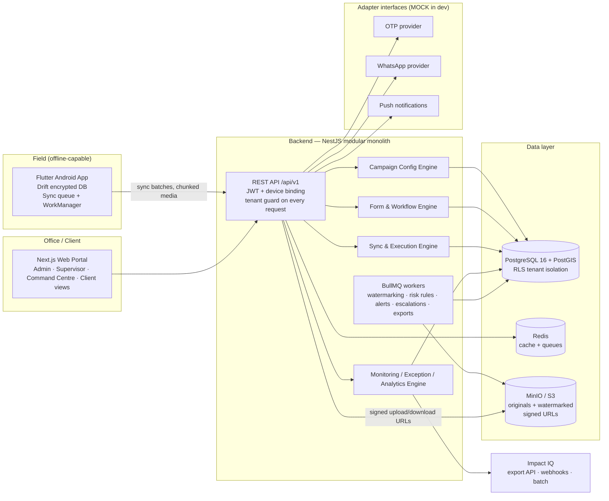
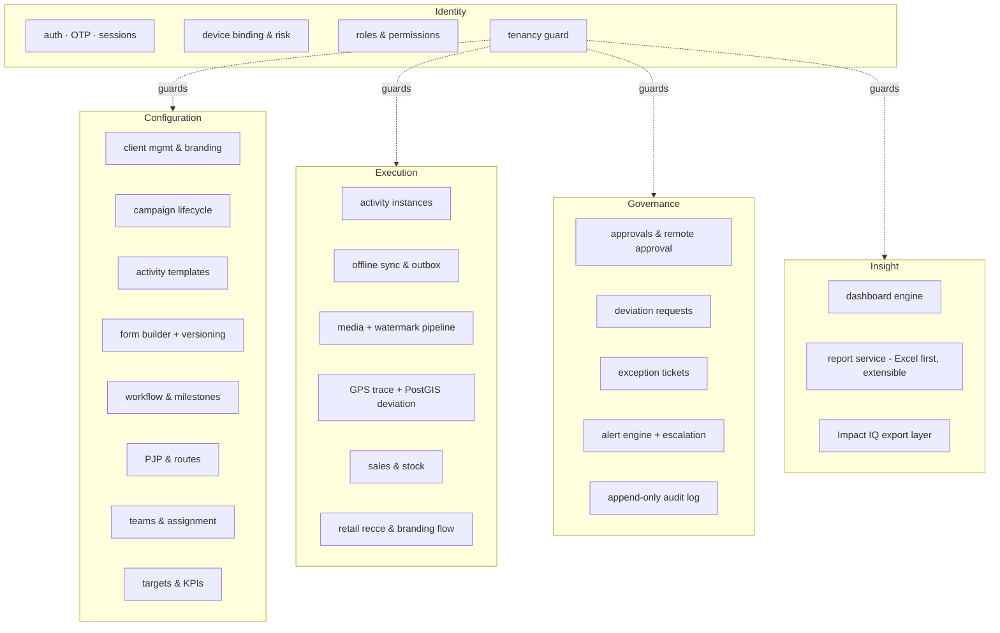

# 02 · System & Module Diagrams

## System diagram



## Backend module diagram (NestJS modules — separable by design)



## Flutter app structure (feature-first)

```
app/lib/
  core/        theming from server branding · localization (hi default) · sync engine · camera service · gps service · risk checks
  features/
    auth/  campaign_select/  home/  assignments/  pjp_route/
    activity/ (milestones, dynamic form renderer)  evidence/
    sales_stock/  deviation/  exceptions/  verification/
    sync_centre/  notifications/  profile/
```

The dynamic form renderer is one engine that draws any FormVersion JSON — the app never contains a client-specific form.
