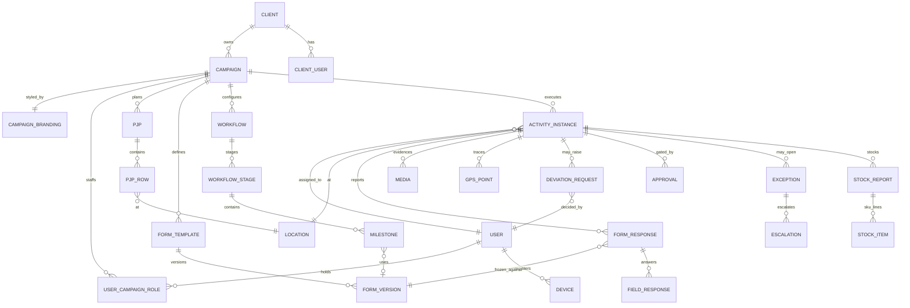

# 03 · Database Design Summary + ERD

## Design principles

1. **UUID primary keys** on every table.
2. **Tenancy columns everywhere relevant:** `tenant_id` (client) and `campaign_id` on all operational tables. Enforced twice: Prisma middleware injects tenant filters on every query, AND PostgreSQL Row-Level Security as defence-in-depth. A missing tenant filter fails closed, not open.
3. **Configuration as versioned JSON, execution as relational rows.** Form definitions, workflow definitions, branding themes and dashboard configs are stored as immutable versioned JSON documents. Field responses, GPS points, stock lines and approvals are proper relational rows for querying and analytics.
4. **Immutability where the spec demands it:**
   - `FormVersion` is frozen on publish — never updated, only superseded. `FormResponse` stores `form_version_id`, so historical reports render forever against the form that existed at capture time.
   - `AuditLog` is append-only: the application role has INSERT and SELECT only — no UPDATE/DELETE grants. Hash-chain column (each row stores hash of previous) makes tampering evident.
5. **Geospatial native:** `Location.point`, `GPSPoint.point`, `Route.line` as PostGIS geography types. Deviation checks (`ST_DWithin` against campaign tolerance) run in the database, not app code.
6. **High-volume tables partitioned:** `GPSPoint` and `AuditLog` partitioned monthly; `Media` metadata indexed by (tenant, campaign, activity).
7. **Analytics-ready:** every operational table carries `created_at`, `updated_at`, `server_received_at` and stable business keys so the Impact IQ export layer can do incremental extracts by watermark timestamp.

## Entity groups (full list per spec §34 — all will exist in the Prisma schema in Phase C)

- **Organisation & access:** Organisation, Client, User, MobileCredential, Role, Permission, RolePermission, UserCampaignRole, Device, LoginSession
- **Campaign:** Campaign, CampaignBranding, ActivityType, CampaignActivity, Geography, Location, PJP, PJPRow, Route, RouteLocation, Team, UserAssignment, Target
- **Forms:** FormTemplate, FormVersion, FormSection, FormQuestion, QuestionOption, ValidationRule, ConditionalRule, FormResponse, FieldResponse
- **Workflow:** Workflow, WorkflowStage, Milestone, StageAssignment, StageApprovalRule
- **Execution:** ActivityInstance, Attendance, CheckIn, CheckOut, GPSPoint, RouteTrace, Media, Signature, StockReport, StockItem, SalesReport, SalesItem, Lead, Retailer, Consumer
- **Governance:** Approval, DeviationRequest, Exception, Alert, Escalation, Comment, AuditLog, Report, DownloadPermission, Notification

## Core ERD (the spine — simplified to the relationships that matter most)

## Key structural decisions

| Concern | Decision |
|---|---|
| Form answers | `FieldResponse` rows (question_id, typed value columns + JSON for complex types) — queryable per question for analytics, not a JSON blob per report |
| Media | Metadata row per file; `variant` column: ORIGINAL / WATERMARKED; object key points to S3; hash (SHA-256) unique-checked per campaign for duplicate detection |
| Offline idempotency | Every device-originated write carries a client-generated `client_ref` UUID; unique constraint (device_id, client_ref) makes retries safe |
| Sync conflicts | Server wins on configuration; device wins on field-captured data (server never overwrites a captured value; conflicting config is re-downloaded) |
| Soft delete | `archived_at` timestamps; hard deletes only via data-retention jobs per campaign rule |
| Geography | Single `Geography` tree (state→region→district→tehsil) with materialised path for fast subtree queries; `Location` leaf carries the PostGIS point |
